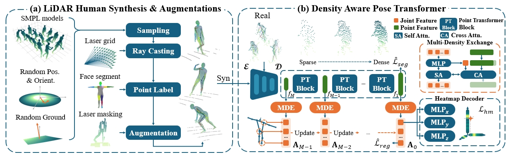

<div align="center">
    <h1>Pre-training a Density-Aware Pose Transformer for Robust LiDAR-based 3D Human Pose Estimation (AAAI 2025)</h1>
    <div>
        <a href='https://github.com/AnxQ/' target='_blank'>Xiaoqi An</a><sup>1</sup>&emsp;
        <a href='https://sharling-lz.github.io/' target='_blank'>Lin Zhao</a><sup>1</sup>&emsp;
        <a href='https://gcatnjust.github.io/ChenGong/index.html' target='_blank'>Chen Gong</a><sup>1</sup>&emsp;
        <a href='https://sites.google.com/view/junlineu/' target='_blank'>Jun Li</a><sup>1</sup>&emsp;
        <a href='https://scholar.google.com/citations?user=6CIDtZQAAAAJ&hl=zh-CN' target='_blank'>Jian Yang</a><sup>1</sup>
    </div>
    <div>
        <sup>1</sup>PCA Lab, Nanjing University of Science and Technology
    </div>
</div>

<div align="center">
    
[](https://arxiv.org/abs/2412.13454)
[](https://www.apache.org/licenses/LICENSE-2.0)

</div>

We propose a simple yet powerful framework, which provides insights both on modeling and augmentation of point clouds.
Specifically, we first propose a concise and effective density-aware pose transformer (DAPT) to get stable keypoint representations. By using a set of joint anchors and a carefully designed exchange module, valid information is extracted from point clouds with different densities. Then 1D heatmaps are utilized to represent the precise locations of the keypoints. 
Secondly, a comprehensive LiDAR human synthesis and augmentation method is proposed to pre-train the model, enabling it to acquire a better human body prior. We increase the diversity of point clouds by randomly sampling human positions and orientations and by simulating occlusions through the addition of laser-level masks.

## DAPT Framework

## Environment
### 1. Clone the project
```bash
​git clone --recursive https://github.com/AnxQ/dapt
```
### 2. Create environment
Please make sure your connection to anaconda and pypi is stable.
```bash
conda env create -f environment.yml
conda activate dapt
```

### 3. Configure Huggingface Accelerate
```bash
accelerate config
```
For details, please refer to [Accelerate documentation](https://huggingface.co/docs/accelerate/package_reference/cli).
Note that differences in computing facilities can lead to some differences in training results.

### 4. Configure Wandb for logging (Optional)
```bash
pip install wandb
wandb login
```

## Data
Please refer to [DATA.md](assets/DATA.md) for data download and preparation.

## Test
Pre-trained checkpoints can be downloaded from [**here**](https://1drv.ms/f/s!As3g2ozBLMgFkJFfEzkp5jvmV7Vp3A?e=pRgQFW).
```bash
accelerate launch main.py configs/dapt-waymo-50b64-finetune.py --test \
    --ckpt checkpoints/dapt-waymo-50b64-finetune.safetensors
```
Change the config name for evaluation on different dataset .
## Train
```bash
# Pre-Training
accelerate launch main.py configs/dapt-synpretrain-50b64.py
# Finetuning
accelerate launch main.py configs/dapt-waymo-50b64-finetune.py \
    --options model.pretrained=work_dir/dapt-synpretrain-50b64/checkpoints/checkpoint_4/model.safetensors
```
Change the config name for training on different dataset.
## Acknowledgement
We thank the following open source projects for helping us implement our idea.
- [Pointcept](https://github.com/Pointcept/Pointcept)
- [LiDAR-HMR](https://github.com/soullessrobot/LiDAR-HMR)
- [LiDARCap](https://github.com/jingyi-zhang/LiDARCap)
- [LiveHPS++](https://github.com/4DVLab/LiveHPS2)
- [MMPose](https://github.com/open-mmlab/mmpose)
- [V2VPoseNet](https://github.com/dragonbook/V2V-PoseNet-pytorch)
## Citation
This will be modified after publication.
```bibtex
@article{an2025dapt,
  title={Pre-training a Density-Aware Pose Transformer for Robust LiDAR-based 3D Human Pose Estimation},
  volume={39},
  doi={10.1609/aaai.v39i2.32169},
  number={2},
  journal={Proceedings of the AAAI Conference on Artificial Intelligence},
  author={An, Xiaoqi and Zhao, Lin and Gong, Chen and Li, Jun and Yang, Jian},
  year={2025},
  pages={1755-1763}
}
```
